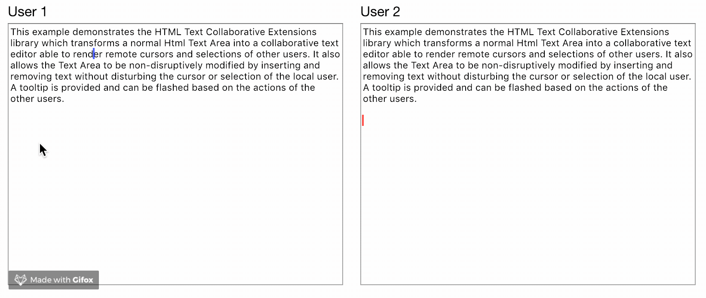

## HTML Text Collaborative Extensions
[](https://travis-ci.org/convergencelabs/html-text-collab-ext)

A set of utilities that enhances a normal HTML `<textarea>` element with collaborative editing capabilities. The enhanced `<textarea>` is able to render the cursor and selection of other collaborators. A tooltip with the collaborator's username can be flashed when remote edits are made. The utility also allows for non-disruptive modification of the `<textarea>` where the local user's selection and cursor are not impacted by changes to the `<textarea>`contents.

This library has no dependency on Convergence. You are free to use whichever data synchronization library or technique fancies you :D

# Demo
The animation below shows the basic functionality provided by this library.



You can see a live demo [here](https://examples.convergence.io/examples/collaborative-textarea/) ([Convergence](https://convergence.io) does the real-time sync).  The code for it can be found [here](https://github.com/convergencelabs/javascript-examples/tree/master/src/examples/collaborative-textarea).


## Installation

Install package with NPM and add it to your development dependencies:

```npm install --save-dev @convergence/html-text-collab-ext```

## Textarea Line Height
For this utiity to work properly, your text area must have a valid numeric line height.  Most user agents default to a value of 1.2, but this must be set explicitly.  For example:

```css
textarea {
  line-height: 1.2;
}
```

Failure to do so may result in the following error:

```
Text areas must have a numeric line-height.
```

## Example Usage

### HTML
```html
<html>
  <body>
    <textarea id="example">
    Some example text to edit.
    </textarea>
  </body>
</html>
```

### JavaScript
```javascript
const textarea = document.getElementById("example");
const textEditor = new HtmlTextCollabExt.CollaborativeTextArea({
  control: textarea,
  onInsert: (index, value) => console.log(`"${value}" was inserted at index ${index}`,
  onDelete: (index, length) => console.log(`"${length}" characters were deleted at index ${index}`,
  onSelectionChanged: (selection) => console.log(`selection was changed to ${JSON.stringify(selection)}`)
}

//
// Selection Management
//
const selectionManager = textEditor.selectionManager();

const collaborator = selectionManager.createCollaborator(
  "test", "Test User", "red", {anchor: 10, target: 20});
collaborator.setSelection({anchor: 5, target: 10});
collaborator.flashCursorToolTip(2);

selectionManager.removeCollaborator("test");

//
// Text Modification
//

// Insert text at index 10
textEditor.insertText(10, "Inserted Text");

// Delete 5 charachters at index 10
textEditor.deleteText(10, 5);

// Set the entire value.
textEditor.setText("New textarea value");
```

## Development

- Use `npm install` to install required dependencies.
- Use `npm run dist` to build the distribution package.
- Use `npm start` to start the example application.

